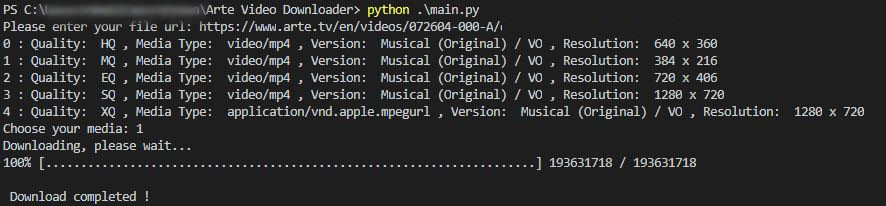

# Arte Video Downloader   

Arte Video Downloader is a simple Python script that lets you download videos from [Arte website](https://www.arte.tv/) while they are available for free online.

* [Usage](#usage)
* [Contributors](#contributors)
* [Disclaimer](#disclaimer)
* [Dependencies](#dependencies)
* [Changelog](#changelog)
* [License](#license)

## Usage

- Make main.py executable and run it.
- Paste your video URL.
- Select the options you want (video quality, language, subtitles).
- Wait for the download to complete, the file will be saved in the scipt's directory. 

## Contributors

[@zbgn](https://github.com/zbgn)

## Disclaimer

This script is only made to download videos that are free do watch. You are the only responsible of how you use it.

## Dependencies

This script uses python 3 with the following dependencies: `urllib3`, `bs2` and `wget`.   

## Changelog

**1.1.0**

Added option to make another download

**1.0.0**

Clean initial version

**0.0.2**

Checks for URL errors

**0.0.1**

Initial Version

## License
[MIT](LICENSE.md "MIT")